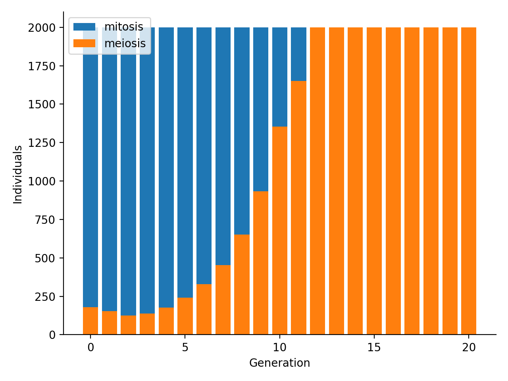
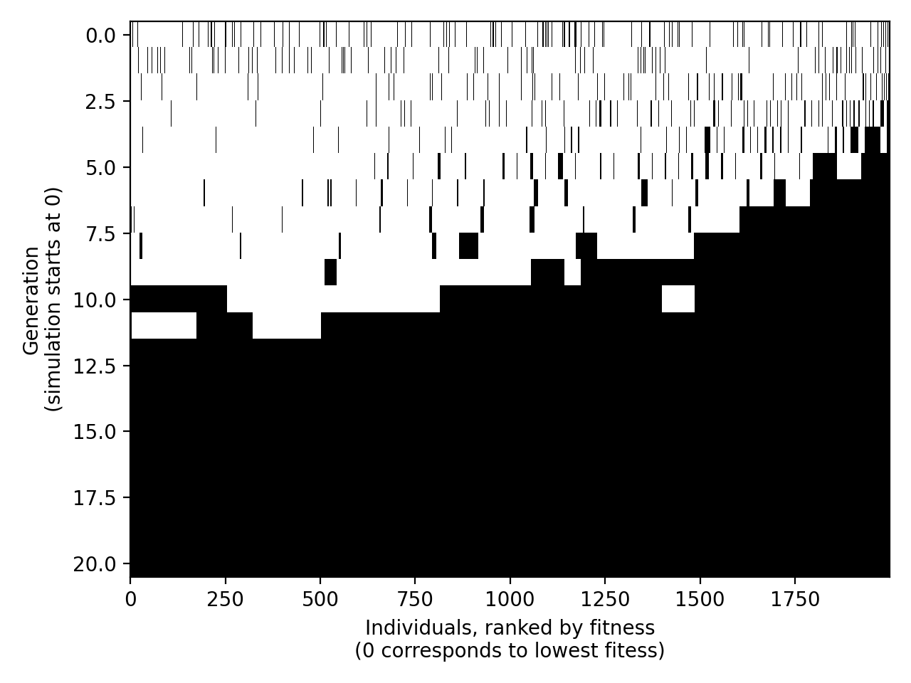

# sex_emergence_simulation

Example parameters:

```
CARRYING_CAPACITY = 2000
START_N_GENOMES = 2000
N_GENES = 100
PLOIDY = 2
MUTATION_RATE = 5 / N_GENES
CROSSING_OVER = True
CROSSINGOVER_LENGTH_MEAN = 10
CROSSINGOVER_LENGTH_SD = 1
START_FRAC_SEX_GENOMES = 0.1
N_GENERATIONS = 20
N_MITOTIC_OFFSPRING = 2
N_MEIOTIC_OFFSPRING = 3
```

Run simulation:

```python
sim = Simulation(
        c=CARRYING_CAPACITY,
        n=N_GENES,
        p=PLOIDY,
        s=START_N_GENOMES,
        h_mean=CROSSINGOVER_LENGTH_MEAN,
        h_sd=CROSSINGOVER_LENGTH_SD,
        x=START_FRAC_SEX_GENOMES,
        g=N_GENERATIONS,
        m=MUTATION_RATE,
        q=N_MITOTIC_OFFSPRING,
        u=N_MEIOTIC_OFFSPRING
    )
    
sim.start()
sim.plot_counts('counts.png')
sim.plot_generations('generations.png')
```





## TODO

- [ ] support the occurrence of changes in gene effects on fitness over time to simulate change in fitness landscape due to drastic sudden changes in the environment
- [ ] run multiple simulations and report stats
- [ ] support interactions between gene effects